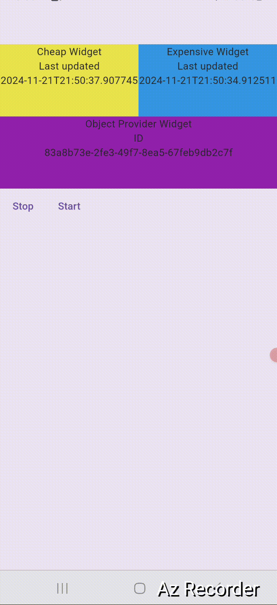

# This project is for excerising Provider with Flutter 

## A Flutter project implementing three different example project with provider.

## Features

1. Breadcrumb 

1.1 Dynamic Breadcrumb Creation
 - Add breadcrumbs with custom names dynamically via a text field.

 1.2 Breadcrumb State Management

 - Active breadcrumbs are styled differently (blue color).
 - All breadcrumbs before the latest are activated automatically.

1.3 Reset Functionality

 - Clear all breadcrumbs at once using the reset button.

1.4 Provider Integration
 - Efficient state management using ChangeNotifier and Consumer.
 

<a></a>
<a></a>


## File stracture

    ├── lib
    │   ├── main.dart
    │   ├── bread_crumb_example.dart 
    │   ├── cheap_and_expensive_object.dart

## Run Locally

Clone the project

```bash
  git clone git@github.com:abdulawalarif/provider_from_course.git
```

Go to the project directory

```bash
  cd provider_from_course
```

Install dependencies

```bash
  flutter pub get
```

Connect a physical device or start a virtual device on your machine

```bash
  flutter run
```

## How to tweak this project for your own uses


## Reporting Bugs or Requesting Features?

If you found an issue or would like to submit an improvement to this project,
please submit an issue using the issues tab above. If you would like to submit a PR with a fix, reference the issue you created!

## Known Issues and Future Work

- 

## Author
- [@abdulawalarif](https://github.com/abdulawalarif)

## License
The MIT License (MIT). Please view the [License](LICENSE) File for more information.
